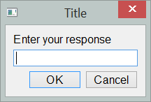

===============================
EasyGUI_Qt
===============================

*Inspired by easygui, designed for PyQt*

EasyGUI_Qt is a module for simple and easy GUI programming in Python.

EasyGUI_Qt was inspired by EasyGUI created by Stephen Ferg and
is based on Tkinter.  By contrast, EasyGUI_Qt is based on PyQt
which is not included in the standard Python distribution - but is
included in some other distributions like Continuum Analytics' Anaconda.

.. image:: https://badge.fury.io/py/easygui_qt.png
    :target: http://badge.fury.io/py/easygui_qt

.. image:: https://pypip.in/d/easygui_qt/badge.png
        :target: https://pypi.python.org/pypi/easygui_qt

* Free software: BSD license
* Documentation: https://easygui_qt.readthedocs.org.

Features
--------

* EasyGUI_Qt is NOT event-driven: all GUI interactions are invoked
by simple function calls.

* EasyGui provides an easy-to-use interface for simple GUI interaction with a
user.  For example, instead of using a print() function to display a message,
show_message() is used which pops a message window; similarly, instead
of Python's input(), get_string() creates a window in which a user
can enter the required information.

