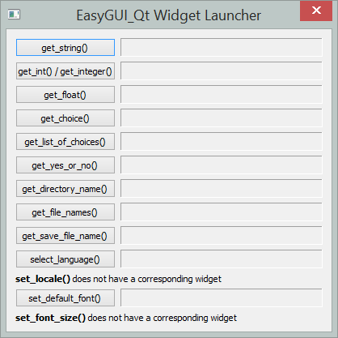

========
Usage
========

To use easygui_qt in a project::

    import easygui_qt

Demos
-----

There are currently two demos.  The first one is a "launcher" which
allows one to see each existing "widget" in action with its default values.
You can run this demo as follows::

    >>> from easygui_qt.demos import launcher
    >>> launcher.main()

There is also another type of demo, whose intention is more to show how
EasyGUI_Qt might be used in a "real-life" situation.

    >>> from easygui_qt.demos.guessing_game import guessing_game
    >>> guessing_game()
